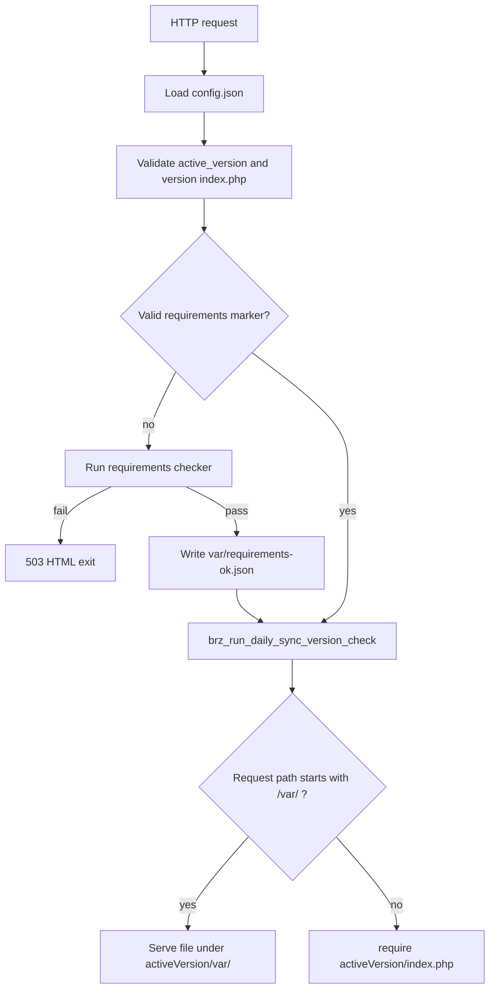

# Brizy server sync wrapper

This directory is a **thin PHP wrapper** around a **versioned standalone Brizy sync application**. The web server document root points here. A single root `config.json` selects which version folder is active (for example `1.13/`). The wrapper loads that tree’s `index.php` for normal requests, after optional environment checks and an automatic version sync check.

## Directory layout

**Wrapper root (this repo layer)**

| Path | Role |
|------|------|
| `index.php` | Front controller: config, requirements marker, daily sync check, `/var/` static handling, then `require` of the active app |
| `config.json` | Root configuration (see below); must exist and be readable |
| `daily_sync_version_check.php` | `brz_run_daily_sync_version_check()` — periodic Cloud sync version check |
| `download_new_version.php` | On-demand update entry point (`UpdateApp` with `app_id`) |
| `update.lock` | Lock file for update operations (must be writable or creatable) |
| `update/` | Updater bootstrap and classes (`UpdateApp`, `CloudClient`, `ConfigStore`, …) |
| `requirements-checker/` | Root requirements UI and `RootProjectRequirements` |
| `var/requirements-ok.json` | Written after a successful requirements run (not shipped; created at runtime) |

**Per deployed version** (e.g. `1.13/`)

Full standalone Symfony app: `1.13/index.php`, `1.13/var/` (cache, uploads, etc.), vendor, and the rest of the sync package layout.

## Request flow

1. Read `config.json` and resolve `active_version` and `{active_version}/index.php`.
2. If `var/requirements-ok.json` is missing or invalid, run the requirements checker. On failure the script exits with **503** and HTML help. On success, write the marker (see below).
3. Run **`brz_run_daily_sync_version_check()`** (at most one real check per 24 hours; see Daily sync).
4. If the URL path starts with `/var/`, serve a **static file** from `{active_version}/var/` (with safety checks). Otherwise **`require`** the active version’s `index.php` (Symfony front controller).

## Configuration

Copy and adjust `config.json.example` to `config.json`. Typical fields:

| Field | Meaning |
|-------|---------|
| `active_version` | Folder name under the wrapper root for the live app (e.g. `"1.13"`). Must match semantic version pattern used in code. |
| `app_id` | Project / app identifier from Brizy Cloud (used for updates). |
| `deploy_url` | Brizy Cloud base URL for sync/update API calls. |
| `last_sync_version_check` | ISO timestamp of the last **daily** sync version check; used with a **86400 s** gate. |
| `last_checked_at` | Informational (e.g. last check metadata from updater). |
| `last_error` | Informational error surface from updater flows. |

Updates may rewrite `config.json` via `ConfigStore` (atomic write). The file must remain readable by PHP.

## Requirements checker and marker

**Purpose:** Validate the server once at setup (writable dirs, PHP extensions, tools used by updates). After success, later requests skip the checker unless the marker is invalid.

**Marker file:** `var/requirements-ok.json`

**Valid marker** (skips checker):

- `checker_version` is **≥ 3** (see `index.php`; bumping this invalidates old markers when rules change).
- `active_version` in the JSON **equals** `active_version` in `config.json` (so a config switch to a new version folder forces a new check).

**On success** the marker is written with `checker_version`, `active_version`, and `checked_at` (ISO).

**Checks** (see `requirements-checker/RootProjectRequirements.php`): wrapper root writable; `{activeVersion}/` writable (Symfony cache, logs, etc.); `update.lock` writable or creatable in a writable directory; PHP `ZipArchive`; `zip` and `unzip` CLI available on the server.

If requirements fail, fix permissions and extensions as indicated, or delete `var/requirements-ok.json` to force a re-check after changes.

## Daily sync version check

Runs **after** requirements pass, from `daily_sync_version_check.php`.

- If `last_sync_version_check` is empty or older than **86400 seconds**, the wrapper loads `update/update_bootstrap.php`, acquires **`update.lock`** via `UpdateLock`, runs **`UpdateApp::runInternal()`** with the configured `app_id`, then sets `last_sync_version_check` in `config.json` to the current UTC time.
- If the active version changes during that run, `$rootConfig`, `$activeVersion`, and `$activeIndexPath` are refreshed before the rest of the request continues.

If another process holds the lock (**409**), the daily check may skip without advancing the timestamp (see code paths in `daily_sync_version_check.php`).

## Manual / on-demand updates

Use **`download_new_version.php`** (e.g. with `app_id` query parameter) for a full **`UpdateApp::run()`** flow outside the daily gate. It uses the same `update/` stack and `update.lock` as the daily path.

## Static URLs under `/var/`

Requests whose path starts with `/var/` are served as files from **`{active_version}/var/`**, not through Symfony, with:

- Path traversal protection (resolved path must stay under that `var` directory).
- Blocked execution of `.php`, `.phtml`, `.phar`.
- MIME types by extension where listed in `index.php`, otherwise `finfo`.

Use this for assets that must be addressed with a `/var/...` URL at the site root.

## Deployment packaging

`deploy_wrapper_on_s3.sh` builds **`sync_wrapper.zip`** with the wrapper files (`index.php`, `daily_sync_version_check.php`, `requirements-checker`, `update`, etc.) for upload to your object storage path.

If you maintain deploy scripts locally, **do not commit real AWS credentials**; use environment variables or CI secrets and inject them at build time.

bash deploy_wrapper_on_s3.sh 1.0 (first version)